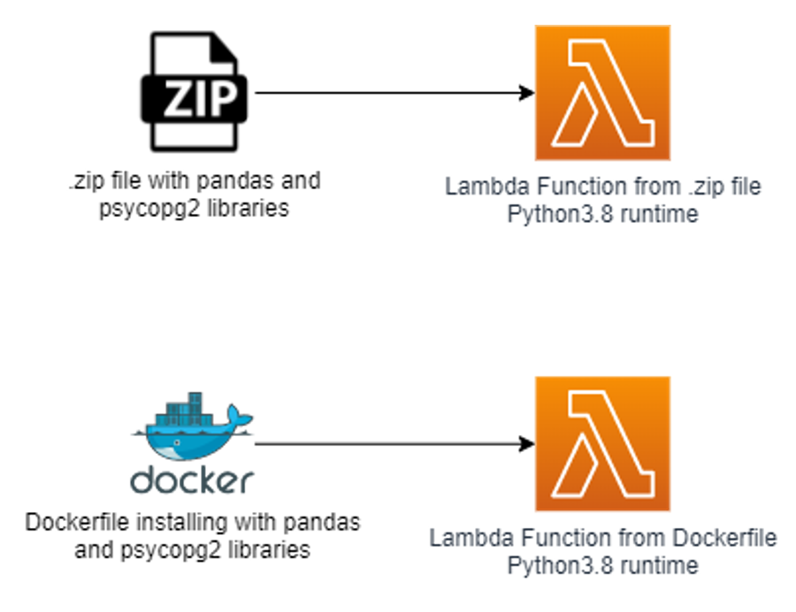

# Import psycopg2 in AWS Lambda to interact with your postgres database

[Psycopg](https://pypi.org/project/psycopg2/) is the most popular PostgresSQL database adapter for Python. It enables developers 
to write a Python application that interacts with a PostgreSQL database.

Among the compute options developers might want to include in their application, there is [AWS Lambda](https://aws.amazon.com/lambda/).
AWS Lambda is a serverless, event-driven compute service that lets developers run code for any type of application or
backend service without provisioning or managing servers. Lambda natively supports Python, Java, Go, PowerShell, Node.js, C#, and Ruby code, and provides a Runtime API 
allowing developers to use any additional programming languages to author functions.

By default, when you create a new function with a **Python runtime** (either version 3.11, 3.10, 3.9, or 3.8), the Lambda 
execution environment is created from an [AWS-provided base image for Lambda](https://github.com/aws/aws-lambda-base-images).

When using Lambda, you will sooner or later need to use libraries, such as `pandas` or `psycopg2`, that are not included in the base image.
To this end, you need to bundle your libraries in a custom package, and attach it to Lambda.

There are multiple ways to do this, including:
* Deploying your Lambda function [from a .zip file archive](https://docs.aws.amazon.com/lambda/latest/dg/configuration-function-zip.html)
* Deploying your Lambda function [from a custom container image](https://docs.aws.amazon.com/lambda/latest/dg/gettingstarted-package.html#gettingstarted-package-images)
* Creating a [Lambda Layer](https://docs.aws.amazon.com/lambda/latest/dg/configuration-layers.html) and attaching it to your Lambda function

In this article, we focus on the **first two**.

With a **.zip deployment package**, adding the `pandas` library to your Lambda function is relatively straightforward. You just create a new folder in your
Linux machine, put the Lambda script together with the `pandas` library and its dependencies in the folder, zip it, and provide it as a source for your Lambda function.

However, **this same method does not work for `psycopg2`**. In this article, we illustrate the error that you will get when trying to use `psycopg2` in your Lambda function created from
a .zip deployment package, and we will see how to edit the Lambda image to make this work.

The code in this repository helps you set up the following target architecture.

# Solution overview

To illustrate the challenges developers might face when using the psycopg2 library in Lambda, this code repository deploys two Lambda functions:
* One Lambda function with the **Python3.8 runtime created from a .zip file**. The `psycopg2` and `libraries` are installed in this .zip deployment package with [pip](https://pypi.org/project/pip/).
* One Lambda function with the **Python3.8 runtime created from a Dockerfile**. The dockerfile installs the `psycopg2` and `pandas` libraries into the Lambda image.

    

For prerequisites and instructions for using this AWS Prescriptive Guidance pattern, see [Import psycopg2 in AWS Lambda to interact with your postgres database](https://apg-library.amazonaws.com/content/be710cff-4445-492f-9f81-45717906c6fd).